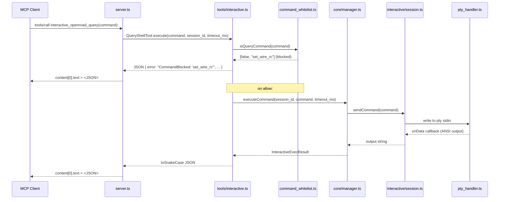

# OpenROAD MCP Server — Architecture

The server is written in TypeScript and distributed via npm as `openroad-mcp`. It implements the
Model Context Protocol over stdio (default) or Streamable HTTP, exposing 12 tools to AI clients.

---

## Module layout

```
typescript/src/
├── main.ts                    # Entry point; reads CLI args, starts transport
├── server.ts                  # Registers all 12 MCP tools; HTTP request handler
├── exceptions.ts              # Shared exception classes (SessionError, PTYError, …)
├── constants.ts               # Shared constants (MAX_COMMAND_HISTORY, timeouts, …)
│
├── config/
│   ├── cli.ts                 # Commander.js CLI flags (--transport, --port, --log-level, …)
│   ├── settings.ts            # Settings singleton loaded from environment variables
│   └── command_whitelist.ts   # Tcl verb allowlist/blocklist; isQueryCommand/isExecCommand
│
├── core/
│   ├── manager.ts             # OpenROADManager: session lifecycle, executeCommand
│   └── models.ts              # Zod result types; toSnakeCase boundary
│
├── interactive/
│   ├── session.ts             # OpenROADSession: PTY lifecycle, output buffering, history
│   ├── pty_handler.ts         # PtyHandler: node-pty spawn, validateCommand, I/O routing
│   ├── buffer.ts              # CircularBuffer: fixed-size output ring buffer
│   └── models.ts              # Session-level types (SessionState, CommandHistoryEntry, …)
│
├── tools/
│   ├── base.ts                # BaseTool: toSnakeCase serialisation, formatResult
│   ├── index.ts               # Re-exports all tool classes
│   ├── interactive.ts         # QueryShellTool, ExecShellTool, session management tools
│   ├── report_images.ts       # ListReportImagesTool, ReadReportImageTool, path security
│   └── docker_orfs.ts         # PullOrfsImageTool, CreateDockerOrfsSessionTool
│
└── utils/
    ├── ansi_decoder.ts        # Strips ANSI escape sequences from PTY output
    ├── cleanup.ts             # CleanupManager: SIGTERM/SIGINT → graceful shutdown
    ├── logging.ts             # pino logger factory; LOG_LEVEL / LOG_FORMAT
    └── path_security.ts       # validatePathSegment, validateSafePathContainment
```

---

## Data flow — stdio transport



---

## Session model

Each session maps to one `node-pty` pseudo-terminal running `openroad -no_init` (configurable).
The PTY's stdin/stdout are mediated by `PtyHandler` and `CircularBuffer`.

```
OpenROADSession
  └── PtyHandler
        └── node-pty IPty   ← pseudo-terminal
              └── openroad process
```

Key properties:

| property | default | env var |
|---|---|---|
| Output buffer | 128 KiB circular | `OPENROAD_DEFAULT_BUFFER_SIZE` |
| Command history | 1000 entries | constant `MAX_COMMAND_HISTORY` |
| Command timeout | 30 s | `OPENROAD_COMMAND_TIMEOUT` |
| Max sessions | 50 | `OPENROAD_MAX_SESSIONS` |

Sessions are **not automatically reaped** when idle. `cleanupIdleSessions()` exists in
`OpenROADManager` but no production code schedules it. Sessions accumulate until manually
terminated or the server shuts down.

---

## Command whitelist

Every Tcl statement sent to a session passes through `command_whitelist.ts` before being written
to the PTY. The whitelist operates at the verb level after splitting on `;`, newlines, and parsing
bracket substitutions.

```
isQueryCommand(stmt)  →  default-deny  (only READONLY_PATTERNS pass)
isExecCommand(stmt)   →  default-allow (only BLOCKED_COMMANDS fail)
```

See [docs/SECURITY.md](docs/SECURITY.md) for the full verb lists.

---

## Transports

### stdio (default)

`StdioServerTransport` from the MCP SDK. stdin/stdout carry JSON-RPC; logs go to stderr.
The server registers a single `onclose` handler that triggers `CleanupManager.triggerShutdown()`.

### Streamable HTTP (`--transport http`)

A bare Node.js `http.createServer` listening on `--host` / `--port` (default `localhost:8000`).
A **new MCP server instance** is created for every HTTP request, so there is no in-memory state
per HTTP connection; session continuity is maintained via the `session_id` tool parameter.

Request body is capped at 1 MB. There is no authentication or CORS — see
[docs/SECURITY.md](docs/SECURITY.md#http-transport-exposure).

---

## Wire format

All tool responses carry a single `content` item of type `"text"`. The `text` field is a JSON
string with **snake_case keys** — `toSnakeCase()` in `tools/base.ts` converts the camelCase
domain models at the boundary. `isError` is never set.

Every result type has a nullable `error: string | null` field (null on success). Blocked commands
also emit a `message` field alongside `error`. See [docs/API.md](docs/API.md) for full shapes.

---

## Golden fixtures and wire contract

The golden fixtures under `typescript/__tests__/golden/fixtures/` are the machine-readable
wire contract. They are generated by booting the live MCP server in-memory, calling
`client.listTools()` and serialising known domain-model instances.

Regenerate after any model or schema change:

```bash
make golden
```

CI asserts no fixture drift (`make golden && git diff --exit-code`).
